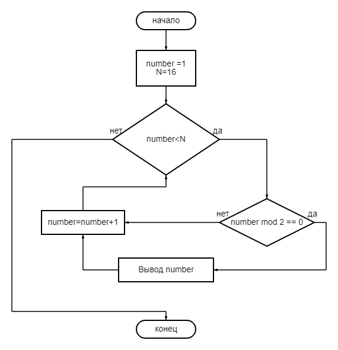

## Задача 1

Найти максимальное из двух чисел

[Код](Rabota1/Program.cs)

## Задача 2

Найти максимальное из трёх чисел

[Код](Rabota2/Program.cs)

## Задача 3

Выяснить чётность

[Код](Rabota3/Program.cs)

## Задача 4

Чётные числа в ряде от 1 до N

[Код](Rabota4/Program.cs)

